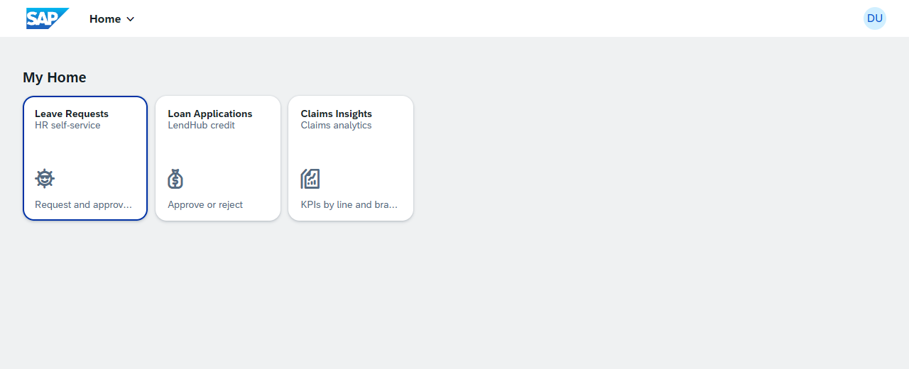
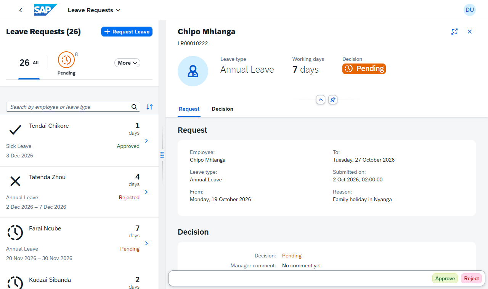
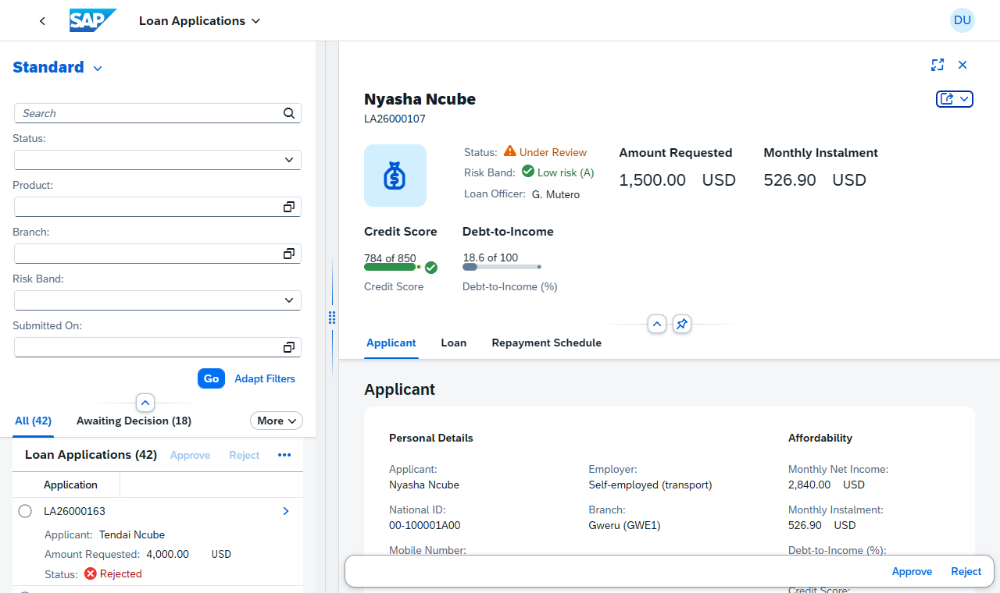
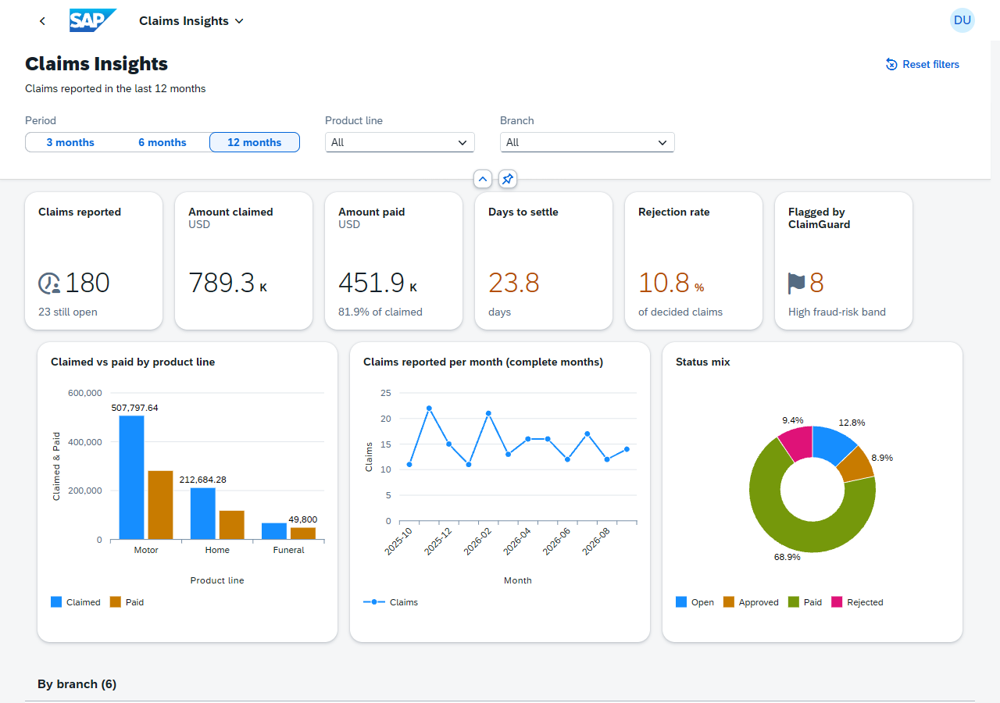

# InsureHub SAP Fiori apps

[](https://github.com/momosto/insurehub-sap-fiori/actions/workflows/ci.yml)

**Live demo:** https://momosto.github.io/insurehub-sap-fiori/ (first load of Loan Applications takes about 20 s: UI5 libraries come from the SAP CDN without preload bundles yet) · **Status:** v0.1.0, three apps built and tested
**Stack:** SAPUI5 1.148 (Horizon) · OData V2 (SAP Gateway contracts) · Fiori elements V2 (List Report / Object Page) · freestyle SAPUI5 (Flexible Column Layout, VizFrame) · Fiori launchpad sandbox · MockServer · QUnit · OPA5 · ui5-test-runner · ESLint · GitHub Actions + Pages

Three SAP Fiori apps for the fictional **InsureHub Group**, an insurer with a microfinance arm (LendHub). They sit on one Fiori launchpad. Each app talks to an OData V2 service shaped exactly like an SAP Gateway service, simulated in the browser by MockServer, so everything runs without an SAP system.



| App | Pattern | What it shows |
|---|---|---|
| **Leave Requests** | freestyle SAPUI5, flexible column layout | employees request leave (working days counted, balance checked); managers approve or reject through OData function imports; withdraw; status tabs with live `$count`; deep links |
| **Loan Applications** | Fiori elements List Report + Object Page, annotation-driven | credit officers triage applications by status and risk band, see affordability, credit score and the repayment schedule, and approve or reject; credit policy (band D never approved) is enforced by the service and shown to the user |
| **Claims Insights** | analytical overview | KPI tiles, claimed vs paid by product line, monthly trend, status mix, branch drill-down; period, product line and branch filters |

| Leave Requests | Loan Applications | Claims Insights |
|---|---|---|
|  |  |  |

## Run it

```bash
npm ci
npm start                          # http://localhost:8080/launchpad/index.html
npm run lint && npm run check      # ESLint + consistency checks (manifests, i18n, metadata, annotations, mock data)
npm test                           # 40 QUnit + OPA5 tests in headless Chrome; report in report/
npm run build                      # static site in dist/ (what GitHub Pages serves)
```

## Quality

- **40 automated UI tests**: 23 unit tests (working days, UTC dates, KPI maths with a hand-worked example, thresholds) and 17 OPA5 journeys. The Loan Applications journeys drive the real launchpad, because Fiori elements V2 needs shell services.
- **Static checks** that fail the build on drift between manifests, i18n, metadata, annotations and mock data. A mutation test proved it catches the bugs it was written for.
- The tests found **three real defects** during the build: deep links in the flexible column layout, an annotation alias that corrupted action names, and an error that never reached the user. All are fixed and recorded in [ADR-0002](docs/adr/0002-gateway-error-format-and-annotation-alias.md).

## Documents

| | |
|---|---|
| [01 Concept paper](docs/01-concept-paper.md) | problem, why three apps and three patterns |
| [02 Requirements](docs/02-requirements.md) | user stories per app, NFRs |
| [03 Architecture](docs/03-architecture.md) | service contracts, mock strategy, routing, production path |
| [04 Security and compliance](docs/04-security-and-compliance.md) | business roles and PFCG design, front-end controls, data protection |
| [05 Test strategy](docs/05-test-strategy.md) | levels, deterministic data, CI gates |
| [06 Delivery plan](docs/06-delivery-plan.md) | steps, definition of done, backlog |
| [07 Traceability](docs/07-traceability.md) | requirement → code → test, defects found |
| [08 Operations](docs/08-operations.md) | running the demo; deploying to an SAP landscape; troubleshooting |
| [09 Test cases](docs/09-test-cases.md) | every test with expected result and last run |
| [ADRs](docs/adr/) | Gateway contract + MockServer, error format, client-side aggregation, CDN + launchpad sandbox |

## Layout

```
apps/
  leave-requests/webapp/       freestyle (FCL), unit + OPA5 tests
  loan-applications/webapp/    Fiori elements V2 + annotations, OPA5 tests via the launchpad
  claims-insights/webapp/      analytical page, aggregator unit tests + OPA5
launchpad/                     launchpad sandbox page and mock bootstrap
appconfig/                     tiles and target mappings
tools/                         check-apps, run-tests, build-site, screenshot
docs/                          lifecycle documents, ADRs, screenshots
```

All people, employers, IDs, phone numbers and figures in the mock data are made up. InsureHub Group is fictional.
