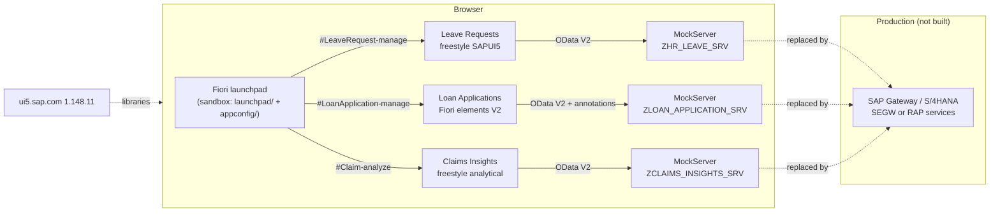

# Architecture

**Version:** 0.1.0 · **Date:** 2026-10-02

## 1. Overview



Each app keeps the Gateway URL a real system would serve (`/sap/opu/odata/sap/<SERVICE>/`). MockServer intercepts those requests in the browser (sinon fake XHR), answers from `localService/mockdata/*.json` and simulates the function imports with the same business rules a backend would enforce. Moving to a real system only takes removing the `initMockServer` bootstrap and deploying the apps. No other code changes.

## 2. Repository layout

```
apps/<app>/webapp/
  manifest.json            descriptor: data source, models, routing, inbound intent
  Component.js             UIComponent (async content creation)
  view/ controller/ fragment/ model/ i18n/ css/
  annotations/             (Loan Applications) UI vocabulary annotations driving Fiori elements
  localService/            metadata.xml, mockdata/*.json, mockserver.js  ← the backend contract
  test/unit/               QUnit
  test/integration/        OPA5 journeys and page objects
launchpad/                 launchpad sandbox page + init.js (starts all mock servers)
appconfig/                 fioriSandboxConfig.json: tile group and target mappings
tools/                     check-apps, run-tests, build-site, screenshot
```

## 3. Service contracts

### ZHR_LEAVE_SRV (Leave Requests)

| Entity set | Key | Operations | Notes |
|---|---|---|---|
| `LeaveRequests` | `RequestId` | read, `$count`, create, MERGE (withdraw) | `Status` P/A/R/W; dates `Edm.DateTime` at 00:00 UTC |
| `LeaveTypes` | `Code` | read | `Balance` in working days |
| `ApproveLeave`, `RejectLeave` | function imports (POST) | `RequestId`, `Comment` | only pending requests; Gateway returns 400 otherwise |

### ZLOAN_APPLICATION_SRV (Loan Applications)

| Entity set | Key | Notes |
|---|---|---|
| `LoanApplications` | `ApplicationID` | read-only; `IsDecidable` drives action enablement (`sap:applicable-path`) |
| `Instalments` | `ApplicationID`, `InstalmentNo` | navigation `to_Instalments` |
| `Products`, `Branches`, `StatusVH`, `RiskBandVH` | value helps | `sap:value-list` standard / fixed-values |
| `ApproveApplication`, `RejectApplication` | function imports with `sap:action-for` | reject needs a non-null `Comment`; band D approval refused with a policy message |

Errors use the Gateway shape, including `innererror.errordetails[].transition = true`. UI5 then treats the message as belonging to the request, and Fiori elements shows it in a dialog. Without the flag the message silently attaches to the object (found during build, ADR-0002).

### ZCLAIMS_INSIGHTS_SRV (Claims Insights)

| Entity set | Key | Notes |
|---|---|---|
| `Claims` | `ClaimID` | product line, branch, dates, status, claimed/paid amounts, `DaysToSettle`, ClaimGuard `RiskBand`, `Flagged` |
| `ProductLines`, `Branches` | code | reference data |

The app reads claims once and aggregates in the browser (`model/aggregator.js`, ADR-0003). In production this becomes an analytical CDS view (`@Analytics.query: true`) with server-side aggregation. The page's figures are designed to map one-to-one onto its measures.

## 4. Key design decisions

| Topic | Decision | ADR |
|---|---|---|
| Backend | OData V2 Gateway contracts, simulated by MockServer | [0001](adr/0001-odata-v2-gateway-contract-with-mockserver.md) |
| Error messages | Gateway error format with `transition` flag | [0002](adr/0002-gateway-error-format-and-annotation-alias.md) |
| Claims analytics | client-side aggregation now, analytical CDS later | [0003](adr/0003-client-side-aggregation-for-claims-insights.md) |
| Hosting | UI5 from CDN, static site, launchpad sandbox | [0004](adr/0004-cdn-ui5-static-hosting-and-launchpad-sandbox.md) |

## 5. Routing and layout (Leave Requests)

`sap.f.routing.Router` with a `FlexibleColumnLayout`. The Component (not the App controller) sets the column layout before each route matches. The root view is created asynchronously (`IAsyncContentCreation`), so on a deep link the first route would otherwise match before the App controller exists, leaving the detail column hidden. The OPA deep-link journeys found this (ADR-0002, defect list in [07-traceability.md](07-traceability.md)).

## 6. Production deployment path (not built)

1. ABAP: implement the three services (SEGW for ECC, or RAP / CDS for S/4HANA), register them in `/IWFND/MAINT_SERVICE`.
2. Build apps with UI5 Tooling (`ui5 build`), deploy to the ABAP repository (`/UI5/UI5_REPOSITORY_LOAD` or `fiori deploy`) or to the BTP HTML5 repository.
3. Launchpad: catalog with three tiles and target mappings matching `appconfig/fioriSandboxConfig.json`; business roles per [04-security-and-compliance.md](04-security-and-compliance.md).
